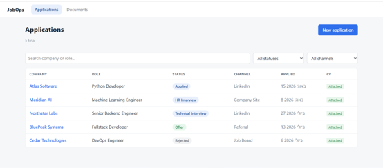
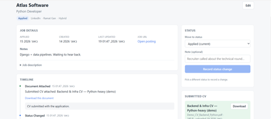
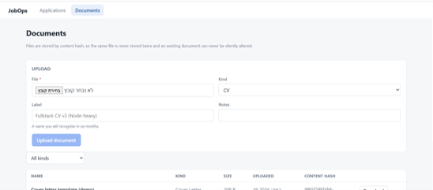

# JobOps

JobOps is a local, single-user job-application tracker. It keeps every application
in one place along with its full status history and the exact CV submitted for it,
so nothing gets lost across inboxes, spreadsheets, and scattered CV files. It is a
personal full-stack project built with a React/TypeScript frontend and a
Python/FastAPI backend over PostgreSQL.

## Screenshots

The data shown below is fictional, generated only for these screenshots.

**Applications overview**



**Application details & timeline**



**Document library**



## Features

- Create and manage job applications (company, role, channel, location, work mode, job URL, description, notes)
- Track the current application status through a defined set of stages
- A timeline that records every event: status changes, notes, scheduled interviews, and document attachments
- Track the exact CV submitted for each application
- A document library for CVs, cover letters, and other files
- Search by company or role, and filter by status and channel
- Paginated application list
- Content-hash (SHA-256) file storage, so identical uploads are automatically deduplicated
- Interactive API documentation (Swagger UI) served by FastAPI

## Tech Stack

**Frontend**
- React
- TypeScript
- Vite

**Backend**
- Python
- FastAPI
- SQLAlchemy

**Data / Infrastructure**
- PostgreSQL
- Alembic
- Docker

**Testing**
- Pytest (backend unit and API tests)
- Vitest (frontend unit tests)
- Playwright (browser end-to-end tests)
- ESLint + Ruff (linting)

## Engineering / Design Highlights

**Event-sourced status history.** `applications.status` is a cached projection of
an append-only event log, not an independent field. A single service-layer
function is the only code that may change status, and it always writes a matching
`status_changed` event in the same database transaction. Because of this, the
generic `PATCH` endpoint rejects a `status` field and a dedicated
`POST /applications/{id}/status` endpoint exists instead — status can never change
without the timeline explaining how and when.

**Content-addressed document storage.** Files are stored under the SHA-256 hash of
their own contents rather than under their uploaded filename. This deduplicates
identical uploads for free, makes stored documents effectively immutable (a
different file is a different hash), and means an untrusted filename is never used
to build a filesystem path.

**Schema migrations.** The PostgreSQL schema is managed with Alembic migrations
rather than auto-created from the models, so schema changes are explicit,
reviewable, and reproducible on a fresh database.

**Layered backend.** HTTP routers stay thin; all business rules live in a service
layer, with SQLAlchemy models and Pydantic schemas kept separate. This keeps the
invariants above enforceable in one place.

**Tests against a real database.** The backend test suite runs against a real
PostgreSQL database built from the actual migrations, with a safety guard that
refuses to run unless the target database has the expected test name — so a
misconfigured environment can never touch development data.

## Running Locally

### Prerequisites

- Python 3.11+
- Node.js 18+
- Docker (for PostgreSQL)

### 1. Clone

```bash
git clone <your-repo-url> jobops
cd jobops
```

### 2. Configure environment

```bash
cp .env.example .env
```

The defaults in `.env.example` match the Docker database below, so no edits are
needed for a standard local setup. The frontend also has a `frontend/.env.example`
with a sensible default API URL.

### 3. Start PostgreSQL

```bash
docker compose up -d
```

Data lives in a named Docker volume, so `docker compose down` keeps it.
(`docker compose down -v` deletes the volume — that is the destructive one.)

### 4. Backend

```bash
cd backend
python -m venv .venv
# Windows:       .venv\Scripts\activate
# macOS / Linux: source .venv/bin/activate
pip install -e ".[dev]"
alembic upgrade head
uvicorn app.main:app --reload --port 8000
```

- API: http://localhost:8000
- Interactive API docs: http://localhost:8000/docs

### 5. Frontend

In a second terminal:

```bash
cd frontend
npm install
npm run dev
```

Open http://localhost:5173.

The port matters: the backend's `CORS_ORIGINS` allows `http://localhost:5173`, so
requests from another port are blocked by the browser.

## Testing

Backend (requires the Docker database to be running):

```bash
cd backend
pytest
```

Frontend unit tests, linting, and production build:

```bash
cd frontend
npm run test
npm run lint
npm run build
```

Browser end-to-end tests (Playwright):

```bash
cd frontend
npm run test:e2e
```

## Project Structure

```
jobops/
├── docker-compose.yml       PostgreSQL only; the app runs natively
├── backend/
│   ├── alembic/versions/    database migrations
│   └── app/
│       ├── api/             HTTP routers — no business logic
│       ├── services/        business rules and invariants
│       ├── models/          SQLAlchemy tables
│       ├── schemas/         Pydantic request/response shapes
│       └── core/            storage, normalisation, errors
└── frontend/
    └── src/
        ├── api/             typed API client (the only place fetch() is called)
        ├── pages/           one component per route
        ├── components/      shared UI pieces
        ├── hooks/           small reusable hooks (data loading, debounce)
        └── lib/             formatting helpers
```

## Status

JobOps is an active personal project that I use to track my own job applications.
The core application is functional end to end: creating and managing applications,
status history, the document library, and submitted-CV tracking all work.

Possible future directions include a browser extension for capturing postings and
optional email ingestion, but these are exploratory and not part of the current
application.
